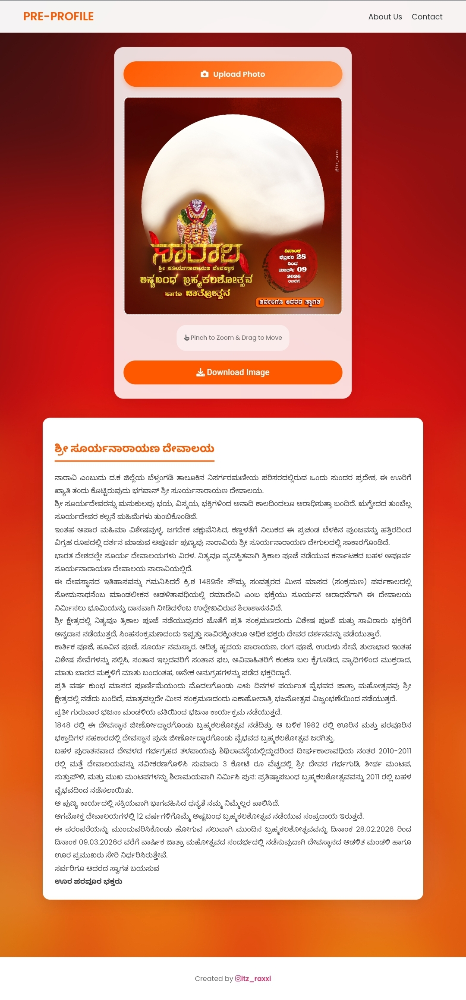

# 🕉️ Sri Suryanarayana Temple Profile Generator

A modern, mobile-responsive web application designed for devotees of the **Sri Suryanarayana Temple, Naravi**. This tool allows users to upload their photos, adjust them within a commemorative frame (mask), and download the result to set as their social media profile picture for the upcoming **Brahmakalashotsava 2026**.


*(Note: Upload a screenshot of your website here to show people what it looks like)*

## ✨ Features

* **🎨 Modern UI:** Designed with a beautiful "Glassmorphism" aesthetic and smooth animations.
* **📱 Mobile-First:** Optimized for touchscreens with pinch-to-zoom and drag-to-move gestures.
* **🔒 Privacy Focused:** All image processing happens in the user's browser. No photos are uploaded to any server.
* **⚡ Fast Performance:** Automatic image resizing to prevent crashes on mobile devices.
* **🌑 Dark Mode Compatible:** Optimized text and backgrounds to look good on all devices.

## 🚀 Live Demo

You can view the live project here:  
**[Link to your GitHub Page]** *https://itz-raxxi.github.io/Naravi/

## 🛠️ Installation & Setup

If you want to run this project locally on your computer:

1.  **Clone the repository:**
    ```bash
    git clone [https://github.com/your-username/your-repo-name.git](https://github.com/your-username/your-repo-name.git)
    ```

2.  **Navigate to the folder:**
    ```bash
    cd your-repo-name
    ```

3.  **Add Assets:**
    Ensure you have the following images in the root folder:
    * `mask.png` (The frame with a transparent center)
    * `background.jpg` (The background wallpaper)

4.  **Run:**
    Simply open `index.html` in any modern web browser (Chrome, Safari, Edge).

## 📂 Project Structure

```text
/
├── index.html      # Main HTML structure (contains CSS & JS)
├── mask.png        # The festival frame overlay (Required)
├── background.jpg  # Background image (Required)
└── README.md       # Project documentation

